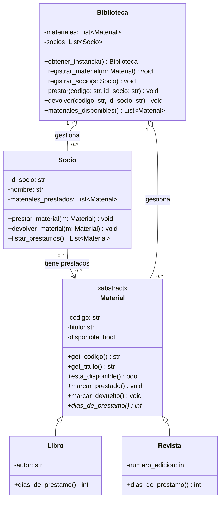

# Sistema de Gestión de Biblioteca

**Trabajo Práctico Integrador (TPI) — Programación Avanzada 2026**

Aplicación de consola para administrar el préstamo y la devolución de materiales en una biblioteca. El foco está en demostrar un buen **diseño orientado a objetos**: encapsulamiento, abstracción, herencia, polimorfismo, una relación entre objetos y un patrón de diseño.

---

## 👥 Integrantes

| Nombre | DNI |
|--------|--------------------------|
| Brizuela, Carla | 35.998.712 |
| Dafne, Araujo   | 47.888.672 |
| Vergara, Lucas  | 35.406.133 |

---

## 🎯 Descripción del dominio

La biblioteca administra distintos tipos de **materiales** (libros y revistas). Cada **socio** puede pedir materiales en préstamo y devolverlos. La **biblioteca** es el sistema central que registra los materiales y socios, y coordina los préstamos.

El sistema permite:

- Registrar materiales y socios.
- Prestar un material a un socio (validando que esté disponible).
- Registrar la devolución de un material.
- Listar materiales disponibles y préstamos de cada socio.

---

## 🧩 Diagrama de Clases (UML)



> El `*` en `dias_de_prestamo()*` indica que es un método **abstracto**. El `$` en `obtener_instancia()$` indica que es un método **estático / de clase**.

---

## 🏛️ Conceptos de POO aplicados

### Encapsulamiento
Los atributos son privados. El atributo `disponible` nunca se cambia desde afuera: solo se modifica mediante `marcar_prestado()` y `marcar_devuelto()`.

### Abstracción
`Material` es una **clase abstracta**: define lo común a todo material pero no puede instanciarse. Declara el método abstracto `dias_de_prestamo()`, que cada subclase debe implementar.

### Herencia
`Libro` y `Revista` **heredan** de `Material`. Reutilizan código (código, título, disponibilidad) y agregan lo propio (autor / número de edición).

### Polimorfismo
`dias_de_prestamo()` responde distinto según el tipo de material, aunque se lo llame igual:

- `Libro` → 15 días
- `Revista` → 7 días

La `Biblioteca` trabaja con objetos `Material` sin saber de qué subclase son: llama a `material.dias_de_prestamo()` y cada objeto responde según su clase real.

---

## 🔗 Relación entre objetos

| Relación | Tipo | Justificación |
|----------|------|---------------|
| `Socio` —▶ `Material` | **Asociación** | El socio conoce los materiales que tiene prestados, pero esos materiales existen de forma independiente. |
| `Biblioteca` ◇— `Material` / `Socio` | **Agregación** | La biblioteca agrupa materiales y socios, pero estos tienen vida propia. |

---

## 🛠️ Patrón de Diseño: Singleton

La clase `Biblioteca` aplica el patrón **Singleton**: debe existir **una sola biblioteca** en toda la aplicación. En lugar de crear varias instancias, se accede siempre a la misma con `Biblioteca.obtener_instancia()`.

---

## ▶️ Instrucciones de ejecución

1. Cloná o descargá el repositorio.
2. Asegurate de tener instalado **Python 3.10 o superior**.
3. Desde la carpeta del proyecto, ejecutá:

```bash
   python main.py
```

4. Se abrirá un menú por consola con las opciones para registrar materiales y socios, prestar, devolver y consultar.

_No requiere instalar librerías externas._


